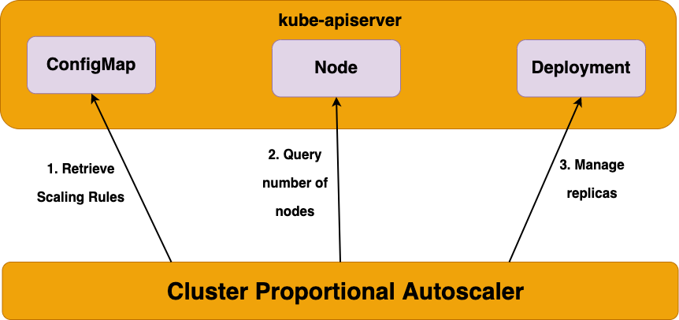

# Cluster Proportional Autoscaler

### Introduction

In this Chapter, we will learn about Cluster proportional autoscaler and how to scale out applications that need to be autoscaled with the size of the cluster

Cluster Proportional autoscaler (CPA) is a horizontal pod autoscaler that scales replicas based on the number of nodes in the cluster. The proportional autoscaler container image watches over the number of schedulable nodes and cores of the cluster and resizes the number of replicas. This functionality is desirable for applications that need to be autoscaled with the size of the cluster such as CoreDNS and other services that scale with the number of nodes/pods in the cluster. CPA has Golang API clients running inside pods that connect to the API Server and polls the number of nodes and cores in the cluster. The scaling parameters and data points are provided via a ConfigMap to the autoscaler and it refreshes its parameters table every poll interval to be up to date with the latest desired scaling parameters. Unlike other autoscalers CPA does not rely on the Metrics API and does not require the Metrics Server

#### How Cluster Proportional Autoscaler works?



#### Cluster Proportional Autoscaler Use Cases
* Over-provisioning
* Scale out core platform services
* Simple and easy mechanism to scale out workloads as it does not require metrics server or prometheus adapter

#### Scaling Methods used by Cluster Proportional Autoscaler
* **Linear**
    * This scaling method will scale the application in direct proportion to how many nodes or cores are available in the cluster
    * Either one of the `coresPerReplica` or `nodesPerReplica` could be omitted
    * When `preventSinglePointFailure` is set to `true`, the controller ensures at least 2 replicas if there are more than one node
    * When `includeUnschedulableNodes` is set to `true`, the replicas will be scaled based on the total number of nodes. Otherwise, the replicas will only scale based on the number of schedulable nodes (i.e., cordoned and draining nodes are excluded)
    * All of `min`,`max`,`preventSinglePointFailure`,`includeUnschedulableNodes` are optional. If not set, `min` will be defaulted to 1, `preventSinglePointFailure` will be defaulted to `false` and `includeUnschedulableNodes` will be defaulted to `false`
    * Both `coresPerReplica` and `nodesPerReplica` are float

**ConfigMap for Linear**
```
data:
  linear: |-
    {
      "coresPerReplica": 2,
      "nodesPerReplica": 1,
      "min": 1,
      "max": 100,
      "preventSinglePointFailure": true,
      "includeUnschedulableNodes": true
    }
```

**The Equation of Linear Control Mode:**
```
replicas = max( ceil( cores * 1/coresPerReplica ) , ceil( nodes * 1/nodesPerReplica ) )
replicas = min(replicas, max)
replicas = max(replicas, min)
```

* **Ladder**
    * This scaling method uses a step function to determine the ratio of nodes:replicas and/or cores:replicas
    * The step ladder function uses the datapoint for core and node scaling from the ConfigMap. The lookup which yields the hugher number of replicas will be used as the target scaling number.
    * Either one of the `coresPerReplica` or `nodesPerReplica` could be omitted
    * Replicas can be set to 0 (unlike in linear mode)
    * Scaling to 0 replicas could be used to enable optional features as a cluster grows

**ConfigMap for Linear**
```
data:
  ladder: |-
    {
      "coresToReplicas":
      [
        [ 1, 1 ],
        [ 64, 3 ],
        [ 512, 5 ],
        [ 1024, 7 ],
        [ 2048, 10 ],
        [ 4096, 15 ]
      ],
      "nodesToReplicas":
      [
        [ 1, 1 ],
        [ 2, 2 ]
      ]
    }
```

#### Comparison of Cluster Proportional Autoscaler and Horizontal Pod Autoscaler
Horizontal Pod Autoscaler is a top level kubernetes API resource. HPA is a closed feedback loop autoscaler which monitors CPU/Memory utilization of the pods and scales the number of replicas automatically. HPA relies on the Metrics API and requires Metrics Server whereas Cluster Proportional Autoscaler does not use Metrics Server nor the Metrics API. Cluster Proportional Autoscaler is not scaled with a kubernetes resource but instead uses flags to identify target workloads and a ConfigMap for scaling configuration. CPA provides a simple control loop that watches the cluster size and scales the target controller. The inputs for CPA are number of schedulable cores and nodes in the cluster


#### In this workshop we will see how Cluster Proportional Autoscaler autoscales CoreDNS service
* The `cluster-proportional-autoscaler` application is deployed separately from the CoreDNS service in the same kube-system namespace
* The autoscaler Pod runs a client that polls the Kubernetes API server for the number of nodes and cores in the cluster
* A desired replica count is calculated and applied to the CoreDNS backends based on the `current schedulable nodes` and `cores` and the given scaling parameters
* The scaling parameters and data points are provided via a `ConfigMap` to the autoscaler, and it refreshes its parameters table every poll interval to be up to date with the latest desired scaling parameters. Changes to the scaling parameters are allowed without rebuilding or restarting the autoscaler Pod.
* The autoscaler provides a controller interface to support two control patterns: `linear` and `ladder`
