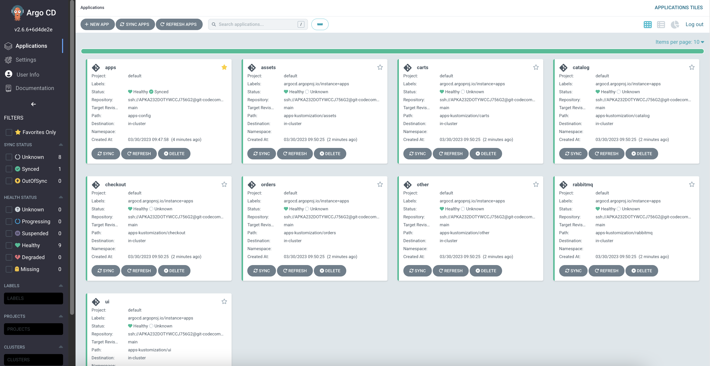

This example shows how to use Helm to create a configuration for a particular (for example DEV) environment.
A typical layout of your Git repository for this might be:

```
.
|-- app
|   |-- application.yaml
|   `-- kustomization.yaml
|-- apps-config
|   |-- ...
`-- apps-kustomization
    ...
```

First, we need to define an Argo CD `App of Apps Application`:

```file
automation/gitops/argocd-app-of-apps/app/application.yaml
```

Let's break down the manifest above:

- First we tell ArgoCD what will be the `name` of our `Application`
- Next we define than when we delete `App of Apps Application` `finalizers` will delete all the applications which belong to this `Application`
- After that we define which Git repository `source` to use to get the desired state of our application. We define `repoUrl` of the Git repository and a the repository branch with `targetRevision`
- Finally we define a `path` to an application configuration within the Git repository

Next, we create templates for each child app:

```
.
|-- app
|   |-- ...
|-- apps-config
|   |-- Chart.yaml
|   |-- templates
|   |   |-- assets.yaml
|   |   |-- carts.yaml
|   |   |-- catalog.yaml
|   |   |-- checkout.yaml
|   |   |-- orders.yaml
|   |   |-- other.yaml
|   |   |-- rabbitmq.yaml
|   |   `-- ui.yaml
|   `-- values.yaml
`-- apps-kustomization
    ...
```

`Chart.yaml` is boiler-plate. `templates` contains one file for each child app, for example:

```file
automation/gitops/argocd-app-of-apps/apps-config/templates/ui.yaml
```

`values.yaml` contains values which are specific for a particular (DEV) environment and which will be applied to all app templates.

```file
automation/gitops/argocd-app-of-apps/apps-config/values.yaml
```

The Git repository in AWS CodeCommit has already been created for you.

<!-- To access Argo CD UI please use these [instructions](/docs/automation/gitops/argocd/access_argocd) -->

```bash
$ GITOPS_REPO_URL=ssh://${GITOPS_IAM_SSH_KEY_ID}@git-codecommit.${AWS_DEFAULT_REGION}.amazonaws.com/v1/repos/${EKS_CLUSTER_NAME}-gitops
$ echo $GITOPS_REPO_URL > ~/environment/gitops_repo_url
```

Let's clone the Git repository.

```bash
$ git clone $(cat ~/environment/gitops_repo_url) ~/environment/gitops
$ cd ~/environment/gitops && git checkout -b main
Switched to a new branch 'main'
$ (cd ~/environment/gitops && \
touch .gitkeep && \
git add . && \
git commit -am "Initial commit" && \
git push --set-upstream origin main)
```

Create an Argo CD repository `Secret` to store `sshPrivateKey` for access to the Git repository `url`:

```bash
$ kubectl -n argocd delete secret git-repo --ignore-not-found && \
kubectl -n argocd create secret generic git-repo \
--from-literal=type=git \
--from-literal=insecure="true" \
--from-literal=url="$(cat ~/environment/gitops_repo_url)" \
--from-file=sshPrivateKey=${HOME}/.ssh/gitops_ssh.pem \
&& kubectl -n argocd label secret git-repo "argocd.argoproj.io/secret-type=repository"
secret/git-repo created
secret/git-repo labeled
```

Copy `Application` configuration which we described above:

```bash
$ cd ~/environment/gitops
$ cp -R /workspace/modules/automation/gitops/argocd-app-of-apps/app ~/environment/gitops/
$ cp ~/environment/gitops_repo_url ~/environment/gitops/app/gitops_repo_url
$ cp -R /workspace/modules/automation/gitops/argocd-app-of-apps/apps-config ~/environment/gitops/
$ yq -i '.spec.source.repoURL = load("./app/gitops_repo_url")' ~/environment/gitops/apps-config/values.yaml

```

Apply `Application` configuration:

```bash
$ kubectl apply -k ~/environment/gitops/app
application.argoproj.io/apps created
$ (cd ~/environment/gitops && \
git add . && \
git commit -am "Adding the App of Apps configuration" && \
git push)
```

Open the Argo CD UI and navigate to the `apps` application.


The default `Refresh` interval is 3 minutes (180 seconds). You could change the interval by updating the "timeout.reconciliation" value in the argocd-cm config map. If the interval is to 0 then Argo CD will not poll Git repositories automatically and alternative methods such as webhooks and/or manual syncs should be used.

For training purposes, let's set `Refresh` interval to 5s and restart argocd application controller to deploy our changes faster

```bash
$ kubectl patch configmap/argocd-cm -n argocd --type merge \
  -p '{"data":{"timeout.reconciliation":"5s"}}'
$ kubectl -n argocd rollout restart deploy argocd-repo-server
$ kubectl -n argocd rollout status deploy/argocd-repo-server
$ kubectl -n argocd rollout restart statefulset argocd-application-controller
$ kubectl -n argocd rollout status statefulset argocd-application-controller
```

We can also use the `Refresh` button to sync an application

We have Argo CD `App of Apps Application` deployed and synced

Our applications, except Argo CD `App of Apps Application`, are in `Unknown` state because we didn't deploy their configuration yet.



We will deploy applications configurations for the applications in the next step
