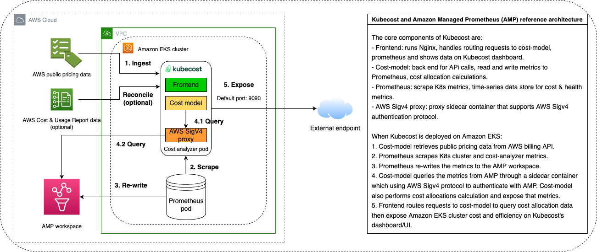

Currently Kubecost is using a self hosted Prometheus instance within our Kubernetes cluster. You can update the Kubecost deployment configuration to use Amazon Managed Service for Prometheus (AMP) instead.

AMP is a Prometheus-compatible monitoring and alerting service that makes it easy to monitor containerized applications and infrastructure at scale. You can use the open-source Prometheus query language to monitor and alert for the performance of containerized workloads without having to worry about scaling the underlying monitoring infrastructure. The service automatically scales the ingestion, storage, alerting, and querying of operational metrics as workloads grow or shrink. Furthermore, it’s integrated with AWS security services to enable fast and secure access to data. This lets you concentrate on your workloads instead of having to manage your monitoring stack.

Below is an image of how Kubecost integrates AMP. Kubecost uses a Signature Version 4 (SigV4) proxy to query AMP. SigV4 is the process to add authentication information to AWS API requests sent by HTTP. For security, most requests to AWS must be signed with an access key. The access key consists of an access key ID and secret access key, which are commonly referred to as your security credentials. When an AWS service receives the request, it performs the same steps that you did to calculate the signature you sent in your request. AWS then compares its calculated signature to the one you sent with the request. If the signatures match, the request is processed. If the signatures don't match, the request is denied.

To get started integrating Kubecost with AMP, check out the following blog: https://aws.amazon.com/blogs/mt/integrating-kubecost-with-amazon-managed-service-for-prometheus/.
